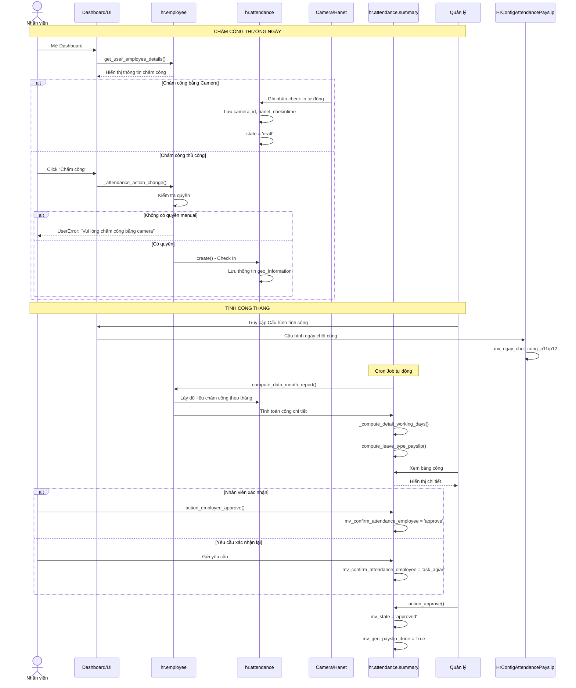
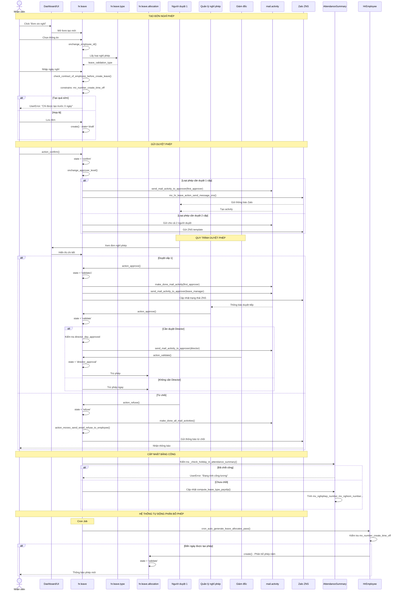

# Sequence Diagram - Nghiệp vụ Chấm công (Attendance)

```mermaid
sequenceDiagram
    actor Employee as Nhân viên
    participant UI as Dashboard/UI
    participant HrEmployee as hr.employee
    participant HrAttendance as hr.attendance
    participant Camera as Camera/Hanet
    participant AttendanceSummary as hr.attendance.summary
    participant Manager as Quản lý

    Note over Employee,Manager: CHẤM CÔNG THƯỜNG NGÀY
    
    Employee->>UI: Mở Dashboard
    UI->>HrEmployee: get_user_employee_details()
    HrEmployee-->>UI: Hiển thị thông tin chấm công
    
    alt Chấm công bằng Camera
        Camera->>HrAttendance: Ghi nhận check-in tự động
        HrAttendance->>HrAttendance: Lưu camera_id, hanet_chekintime
        HrAttendance->>HrAttendance: state = 'draft'
    else Chấm công thủ công
        Employee->>UI: Click "Chấm công"
        UI->>HrEmployee: _attendance_action_change()
        HrEmployee->>HrEmployee: Kiểm tra quyền
        alt Không có quyền manual
            HrEmployee-->>Employee: UserError: "Vui lòng chấm công bằng camera"
        else Có quyền
            HrEmployee->>HrAttendance: create() - Check In
            HrAttendance->>HrAttendance: Lưu thông tin geo_information
        end
    end
    
    Note over Employee,Manager: TÍNH CÔNG THÁNG
    
    Manager->>UI: Truy cập Cấu hình tính công
    UI->>HrConfigAttendancePayslip: Cấu hình ngày chốt công
    HrConfigAttendancePayslip->>HrConfigAttendancePayslip: mv_ngay_chot_cong_p11/p12
    
    Note over AttendanceSummary: Cron Job tự động
    AttendanceSummary->>HrEmployee: compute_data_month_report()
    HrEmployee->>HrAttendance: Lấy dữ liệu chấm công theo tháng
    HrEmployee->>AttendanceSummary: Tính toán công chi tiết
    AttendanceSummary->>AttendanceSummary: _compute_detail_working_days()
    AttendanceSummary->>AttendanceSummary: compute_leave_type_payslip()
    
    Manager->>AttendanceSummary: Xem bảng công
    AttendanceSummary-->>Manager: Hiển thị chi tiết
    
    alt Nhân viên xác nhận
        Employee->>AttendanceSummary: action_employee_approve()
        AttendanceSummary->>AttendanceSummary: mv_confirm_attendance_employee = 'approve'
    else Yêu cầu xác nhận lại
        Employee->>AttendanceSummary: Gửi yêu cầu
        AttendanceSummary->>AttendanceSummary: mv_confirm_attendance_employee = 'ask_agian'
    end
    
    Manager->>AttendanceSummary: action_approve()
    AttendanceSummary->>AttendanceSummary: mv_state = 'approved'
    AttendanceSummary->>AttendanceSummary: mv_gen_payslip_done = True
```
# Sequence Diagram - Nghiệp vụ Nghỉ phép (Leave)

```mermaid
sequenceDiagram
    actor Employee as Nhân viên
    participant UI as Dashboard/UI
    participant HrLeave as hr.leave
    participant HrLeaveType as hr.leave.type
    participant HrLeaveAllocation as hr.leave.allocation
    participant FirstApprover as Người duyệt 1
    participant LeaveManager as Quản lý nghỉ phép
    participant Director as Giám đốc
    participant MailActivity as mail.activity
    participant ZaloZNS as Zalo ZNS

    Note over Employee,ZaloZNS: TẠO ĐỚN NGHỈ PHÉP
    
    Employee->>UI: Click "Đơn xin nghỉ"
    UI->>HrLeave: Mở form tạo mới
    
    Employee->>HrLeave: Chọn thông tin
    HrLeave->>HrLeave: onchange_employee_id()
    HrLeave->>HrLeaveType: Lấy loại nghỉ phép
    HrLeaveType-->>HrLeave: leave_validation_type
    
    Employee->>HrLeave: Nhập ngày nghỉ
    HrLeave->>HrLeave: check_contract_of_employee_before_create_leave()
    HrLeave->>HrLeave: constrains: mv_number_create_time_off
    
    alt Tạo quá sớm
        HrLeave-->>Employee: UserError: "Chỉ được tạo trước X ngày"
    else Hợp lệ
        Employee->>HrLeave: Lưu đơn
        HrLeave->>HrLeave: create() - state='draft'
    end
    
    Note over Employee,ZaloZNS: GỬI DUYỆT PHÉP
    
    Employee->>HrLeave: action_confirm()
    HrLeave->>HrLeave: state = 'confirm'
    HrLeave->>HrLeave: onchange_approver_level()
    
    alt Loại phép cần duyệt 1 cấp
        HrLeave->>MailActivity: send_mail_activity_to_approver(first_approver)
        HrLeave->>ZaloZNS: mv_hr_leave_action_send_message_zns()
        ZaloZNS-->>FirstApprover: Gửi thông báo Zalo
        MailActivity-->>FirstApprover: Tạo activity
    else Loại phép cần duyệt 2 cấp
        HrLeave->>MailActivity: Gửi cho cả 2 người duyệt
        HrLeave->>ZaloZNS: Gửi ZNS template
    end
    
    Note over FirstApprover,Director: QUY TRÌNH DUYỆT PHÉP
    
    FirstApprover->>UI: Xem đơn nghỉ phép
    UI->>HrLeave: Hiển thị chi tiết
    
    alt Duyệt cấp 1
        FirstApprover->>HrLeave: action_approve()
        HrLeave->>HrLeave: state = 'validate1'
        HrLeave->>MailActivity: make_done_mail_activity(first_approver)
        HrLeave->>MailActivity: send_mail_activity_to_approver(leave_manager)
        HrLeave->>ZaloZNS: Cập nhật trạng thái ZNS
        MailActivity-->>LeaveManager: Thông báo duyệt tiếp
        
        LeaveManager->>HrLeave: action_approve()
        HrLeave->>HrLeave: state = 'validate'
        
        alt Cần duyệt Director
            HrLeave->>HrLeave: Kiểm tra director_day_approved
            HrLeave->>MailActivity: send_mail_activity_to_approver(director)
            Director->>HrLeave: action_validate()
            HrLeave->>HrLeave: state = 'director_approval'
            HrLeave->>HrLeaveAllocation: Trừ phép
        else Không cần Director
            HrLeave->>HrLeaveAllocation: Trừ phép ngay
        end
        
    else Từ chối
        FirstApprover->>HrLeave: action_refuse()
        HrLeave->>HrLeave: state = 'refuse'
        HrLeave->>MailActivity: make_done_all_mail_activities()
        HrLeave->>HrLeave: action_moveo_send_email_refuse_to_employee()
        HrLeave->>ZaloZNS: Gửi thông báo từ chối
        ZaloZNS-->>Employee: Nhận thông báo
    end
    
    Note over Employee,ZaloZNS: CẬP NHẬT BẢNG CÔNG
    
    HrLeave->>AttendanceSummary: Kiểm tra _check_holiday_in_attendance_summary()
    
    alt Đã chốt công
        AttendanceSummary-->>HrLeave: UserError: "Đang tính công-lương"
    else Chưa chốt
        HrLeave->>AttendanceSummary: Cập nhật compute_leave_type_payslip()
        AttendanceSummary->>AttendanceSummary: Tính mv_nghiphep_number, mv_nghiom_number...
    end
    
    Note over Employee,ZaloZNS: HỆ THỐNG TỰ ĐỘNG PHÂN BỔ PHÉP
    
    Note over HrLeave: Cron Job
    HrLeave->>HrEmployee: cron_auto_generate_leave_allocates_pass()
    HrEmployee->>HrEmployee: Kiểm tra mv_number_create_time_off
    
    alt Đến ngày được tạo phép
        HrEmployee->>HrLeaveAllocation: create() - Phân bổ phép năm
        HrLeaveAllocation->>HrLeaveAllocation: state = 'validate'
        HrLeaveAllocation-->>Employee: Thông báo phép mới
    end
```
